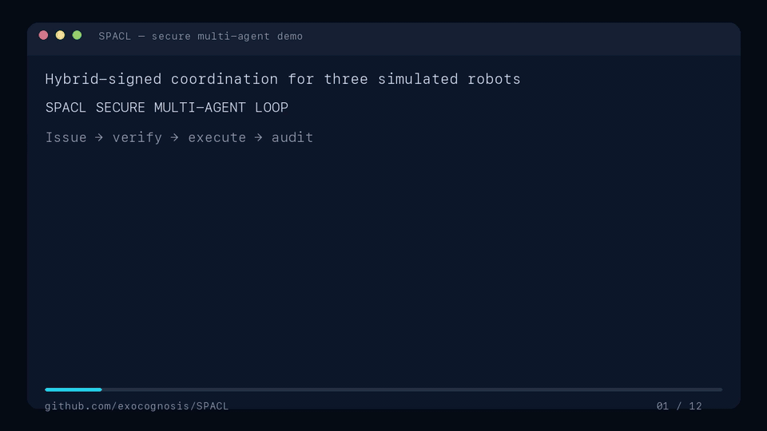
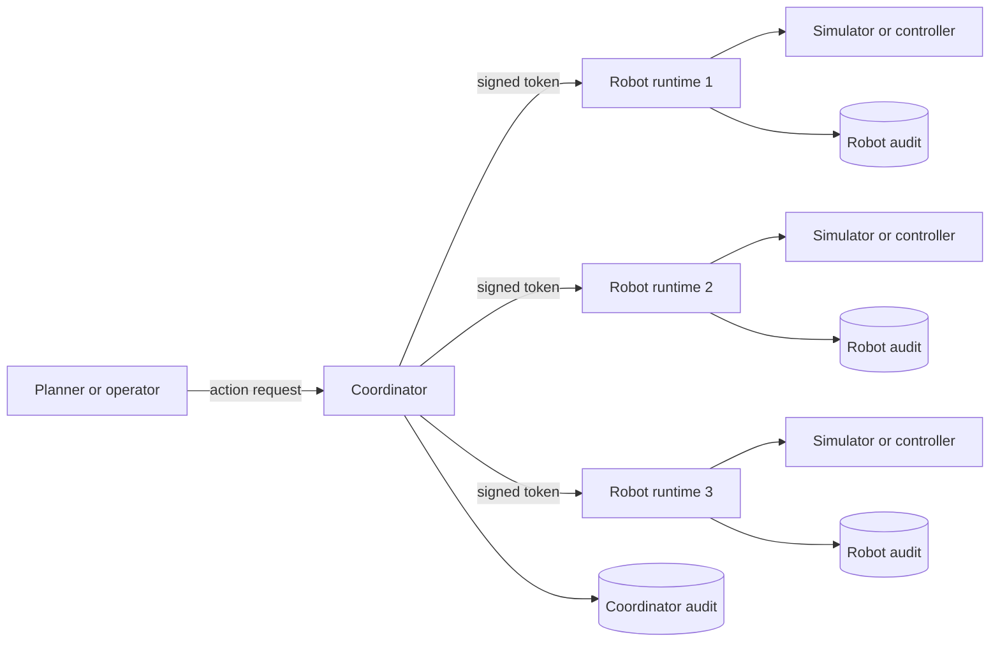

# SPACL - Secure Physical Agent Coordination Layer

[](LICENSE) [](#threat-model)

SPACL is a secure coordination layer for Physical AI and robot fleets.



**Fastest path:** Run `cargo run --release -- --no-color --data-dir ./.spacl-demo demo --watch` from the repository root. You will see three signed tokens, one modified-token rejection, three completed actions, and four verified audit chains.

## Problem

High-level AI can plan robot work, but robot controllers must not trust raw planner commands. A robot must know who authorized an action, whether the action changed in transit, whether it is fresh and in sequence, and whether it complies with local policy.

Robot fleets also need evidence after execution. Operators need a verifiable record of which command was authorized, which robot accepted it, what policy applied, and what result the robot reported.

## Solution

SPACL puts a cryptographic execution gate between planners and robot controllers.

- **Secure identities:** Coordinators and robots use hybrid ML-DSA-65 and Ed25519 identities.
- **Authenticated commands:** The coordinator signs each action and its execution context into a short-lived token.
- **Policy enforcement:** Each robot checks token validity, order, context, and local policy limits before execution.
- **Tamper-evident logs:** The coordinator and each robot write signed, hash-chained audit records for authorization, acceptance, rejection, and execution.

In the demo, three robots receive separate `move`, `pick`, and `place` tasks. SPACL modifies one signed token and proves that the target robot rejects it. The three original tokens execute, task ownership remains visible, and all four audit chains verify.

## Quick Start

Prerequisites: Rust 1.88 or later and Git.

From the repository root, run one command:

```bash
cargo run --release -- --no-color --data-dir ./.spacl-demo demo --watch
```

Expected output includes:

```text
task assigned warehouse-task-1 -> sim-robot-1
token distributed coordinator -> sim-robot-1 ...
invalid token rejected sim-robot-1 reason=token signature is invalid ...
valid token accepted sim-robot-1
...
shared task state
audit chains verified
  coordinator records=9
  sim-robot-1 records=3
  sim-robot-2 records=2
  sim-robot-3 records=2
demo complete
```

The command creates one coordinator, three robot runtimes, three signed tokens, execution receipts, persistent state, and four verified audit chains. See the [embedded demo above](#spacl---secure-physical-agent-coordination-layer).

## Architecture Overview



The coordinator enrolls robot identities, assigns task ownership, checks authorization policy, and signs action tokens. Each robot runtime pins the coordinator identity and acts as a separate execution gate. It releases an action only after all token and local-policy checks pass. The current adapter simulates robot actions; a future ROS 2 adapter will occupy the controller boundary.

## Implemented in v0.2.0 / Phase 0

- Hybrid ML-DSA-65 and Ed25519 identity signatures
- Signed action tokens with replay, sequence, expiry, target, context, and policy gates
- Persistent robot enrollment, revocation, and exclusive task ownership
- High-risk two-person approval assertion and robot emergency-stop checks
- Signed, hash-chained coordinator and robot audit logs
- REST API, OpenAPI description, Prometheus metrics, and CLI tools
- One-command single-robot and three-robot simulations
- Docker image and one executable per node

## Threat Model

### Adversaries

- Network clients that inject, modify, replay, delay, or drop development traffic
- Compromised planners, coordinator hosts, robot hosts, or software keys
- Clients that attempt denial of service or storage exhaustion

### Assumptions

- Each robot has the correct coordinator public identity and uses the runtime as its only software command path.
- Hosts, clocks, filesystems, and the isolated development network are trusted.
- A separate physical safety controller enforces motion and hazard limits.

### Non-Goals for v0.2.0

- Production transport security, authenticated human approvals, or hardware-backed keys
- Production robot control, physical safety certification, or sensor attestation
- Replicated consensus, automatic failover, or Byzantine fault tolerance

> [!WARNING]
> SPACL v0.2.0 is a simulation MVP. Do not connect it to a production robot without an independent security review, authenticated transport, operator authentication, a physical safety controller, and site-specific hazard controls.

Read the full [Threat Model](docs/threat-model.md), [Security Model and Token Format](docs/security.md), and [Security Policy](SECURITY.md).

## Technical Specifications

| Area | Current MVP |
| --- | --- |
| Runtime | Rust 1.88+, one executable per node |
| Cryptography | Hybrid ML-DSA-65 and Ed25519 signatures; ML-KEM-768 primitive |
| Interfaces | CLI, REST JSON, OpenAPI 3.1, and Prometheus metrics |
| State | JSON snapshots and signed JSON Lines audit chains |
| Deployment | Three simulated robots demonstrated; 3–10 target scale |

See the [technology stack](docs/stack.md), [token format](docs/security.md), [API specification](docs/openapi.yaml), and [deployment guide](docs/deployment.md) for implementation details.

## Repository Layout

```text
src/
  coordinator.rs       enrollment, task ownership, and token issuance
  runtime.rs           robot verification and execution gate
  crypto.rs            hybrid identities and signatures
  key_establishment.rs ML-KEM-768 primitive
  audit.rs             signed hash-chain audit log
  main.rs              CLI and REST services
tests/                  security-control and end-to-end tests
docs/                   architecture, security, API, and deployment guides
examples/               client and planner examples
scripts/                reproducible demo-video renderer
```

## Documentation

- [Architecture](docs/architecture.md)
- [Threat model](docs/threat-model.md)
- [Security model and token format](docs/security.md)
- [Minimal technology stack](docs/stack.md)
- [API reference](docs/api.md) and [OpenAPI 3.1](docs/openapi.yaml)
- [Deployment](docs/deployment.md) and [configuration](docs/configuration.md)
- [ROS 2 integration boundary](docs/ros2.md)
- [Troubleshooting](docs/troubleshooting.md)
- [Client and planner examples](examples/README.md)
- [Demo video provenance](docs/demo/README.md)
- [Changelog](CHANGELOG.md)

## Planned

- **Phase 1:** Task lifecycle, controlled reassignment, replicated state, recovery, and terminal operator console
- **Phase 2:** Authenticated ML-KEM transport, signed operator approvals, ROS 2, Gazebo, and extended policies
- **Phase 3:** Fault injection, benchmarks, packaging, external security review, and pilot deployment
- **Later:** Threshold approvals, hardware roots of trust, signed Merkle batches, and richer policy languages

## License

SPACL is licensed under the [Apache License 2.0](LICENSE). Read [CONTRIBUTING.md](CONTRIBUTING.md) and [CODE_OF_CONDUCT.md](CODE_OF_CONDUCT.md) before you submit a change.
