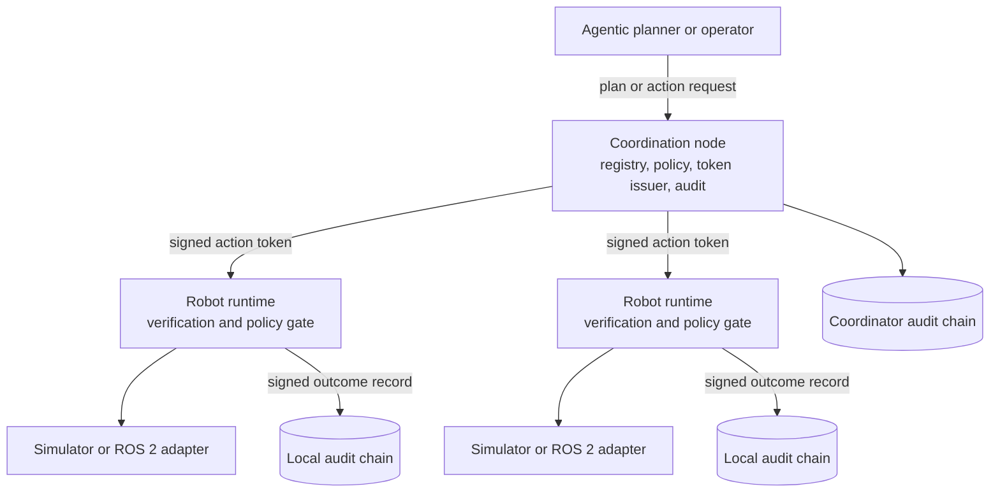
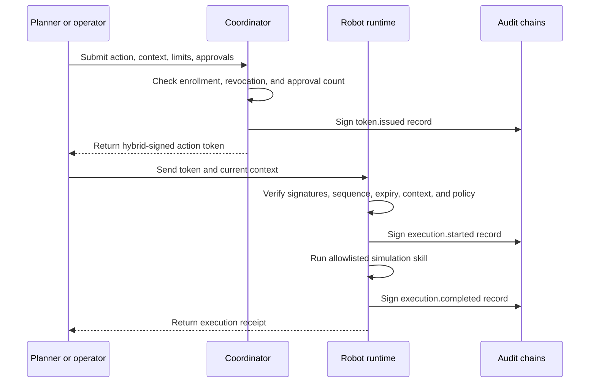

# SPACL - Secure Physical Agent Coordination Layer

**Secure, quantum-resistant coordination and accountability for multi-robot and Physical AI fleets.**

[](https://github.com/exocognosis/SPACL/actions/workflows/ci.yml)
[](LICENSE)
[](#project-status-and-scope)

> [!WARNING]
> SPACL v0.2.0 is an early MVP. It is not safety-certified. Do not connect it to a production robot without an independent security review, a physical safety controller, and site-specific hazard controls.

## Overview

SPACL is middleware between high-level planners and robot controllers. It converts actions into signed, context-bound tokens. A robot runtime executes an action only after it verifies the token signature, target, sequence, expiry, context, and policy limits.

The current release supplies a deployable Phase 0 vertical slice. It uses hybrid ML-DSA-65 and Ed25519 signatures. It also writes signed, hash-chained audit records for enrollment, token issuance, execution, rejection, revocation, and emergency-stop events.

## Five-Minute Tour

Build SPACL. Then create an isolated workspace and run the interactive demo:

```bash
cargo build --release
export PATH="$PWD/target/release:$PATH"
spacl --data-dir ./.spacl-tour init
spacl --data-dir ./.spacl-tour demo --interactive --watch
```

Press Enter to accept each default action. You can also choose `move`, `pick`, `place`, or `wait` for each robot. SPACL enrolls three simulated robots and executes the selected tokens. Each `pick` token contains two operator approval assertions.

Inspect the coordinator timeline:

```bash
spacl audit pretty \
  --audit ./.spacl-tour/demos/<timestamp>/coordinator/audit.jsonl
```

You should now see four audit chains: one coordinator chain and three robot chains.

**Key value**

- Hybrid post-quantum and classical identity signatures
- Verifiable action tokens with replay and sequence protection
- Context, zone, speed, force, skill, and expiry controls
- Two-person approval checks for high-risk actions
- Signed audit chains for physical action accountability
- REST interfaces for agentic planners and robot execution gates
- A three-robot simulation that needs no robot hardware

## Features

- [x] Hybrid ML-DSA-65 and Ed25519 device identity
- [x] Signed action token issuance and robot-side verification
- [x] Sequence, replay, expiry, context, and policy gates
- [x] Persistent robot registry and identity revocation
- [x] Two-person approval assertion for high-risk tokens
- [x] Emergency-stop gate in each robot runtime
- [x] Signed, hash-chained JSON Lines audit logs
- [x] Coordinator and robot REST services
- [x] Three-robot simulation path
- [x] Container image definition and continuous integration workflow
- [x] Workspace initialization, TOML configuration, and status checks
- [x] CLI wrappers for token issue and execution
- [x] Human-readable audit tail and timeline commands
- [x] Machine-readable API rejection codes and next actions
- [x] Prometheus metrics endpoint
- [x] OpenAPI 3.1 description and development API console
- [ ] Authenticated operator accounts and signed operator approvals
- [ ] ML-KEM secure transport and mutual endpoint authentication
- [ ] Replicated coordination state and automatic failover
- [ ] Task ownership and conflict detection
- [ ] ROS 2 and Gazebo adapters
- [ ] Production operator console
- [ ] Signed Merkle-root audit batches

## Architecture





The coordination node is an authorization trust boundary. Robot runtimes trust its pinned public identity. Each runtime is a separate execution trust boundary. The simulated skill adapter does not send commands to hardware.

The current HTTP services do not provide transport security or client authentication. Bind them to loopback or an isolated test network. See [Architecture](docs/architecture.md) and [Security Model](docs/security.md).

## Tech Stack

- **Core language:** Rust 1.88 or later
- **Signatures:** ML-DSA-65 (Federal Information Processing Standard (FIPS) 204) and Ed25519
- **Hashing:** SHA-256
- **Interfaces:** REST, OpenAPI 3.1, JSON, and a Clap CLI
- **State:** Atomic JSON snapshots and append-only JSON Lines audit chains
- **Robot integration:** Simulator in v0.2.0; ROS 2 adapter is planned
- **Deployment:** One executable or one container per node

## Quick Start

### Prerequisites

- Rust 1.88 or later
- Git
- Optional: Docker 24 or later

### Build and Test

```bash
git clone https://github.com/exocognosis/SPACL.git
cd SPACL
cargo build --release
cargo test --all-targets
```

### Run the Three-Robot Simulation

```bash
cargo run --release -- --data-dir ./data demo --output ./data/demo-1 --watch
```

The demo performs these operations:

1. Generate one coordinator identity and three robot identities.
2. Enroll the three simulated robots.
3. Issue one context-bound token to each robot.
4. Require two operator IDs for the high-risk `pick` action.
5. Execute `move`, `pick`, and `place` through separate robot gates.
6. Save coordinator and robot audit chains under `./data/demo-1`.

### Generate an Identity

```bash
cargo run --release -- --data-dir ./data keygen \
  --subject robot-1 \
  --private-out ./secrets/robot-1.identity.json \
  --public-out ./config/robot-1.public.json
```

SPACL sets private identity files to mode `0600` on Unix systems.

### Start a Coordination Node

Run `spacl --data-dir ./.spacl-dev init` once if you want to use the generated configuration and sample robot.

```bash
RUST_LOG=spacl=info cargo run --release -- --data-dir ./.spacl-dev coordinator \
  --bind 127.0.0.1:8080
```

### Start a Robot Runtime

First enroll the robot public identity through `POST /v1/robots`. Then run the robot gate:

```bash
RUST_LOG=spacl=info cargo run --release -- --data-dir ./.spacl-dev robot \
  --config ./.spacl-dev/config/robot-1.toml
```

See the [API Reference](docs/api.md) for enrollment, token issuance, execution, revocation, and emergency-stop requests.

### Use the CLI Instead of Raw JSON

```bash
spacl token issue \
  --robot-id robot-1 \
  --skill move \
  --task-id order-1042 \
  --zone aisle-3 \
  --speed 0.5

spacl execute \
  --token <workspace>/tokens/<token-id>.json \
  --task-id order-1042 \
  --zone aisle-3
```

Run `spacl <command> --help` for examples and required options. Add `--json-logs` to a service command for structured logs. Add `--compact` for compact command JSON.

### Verify or Read an Audit Chain

```bash
cargo run --release -- audit verify \
  --audit ./data/coordinator/audit.jsonl \
  --public-identity ./data/coordinator/coordinator.public.json
```

```bash
spacl audit tail --audit ./data/coordinator/audit.jsonl --follow
spacl audit pretty --audit ./data/coordinator/audit.jsonl
```

### Use Common Development Commands

Install [just](https://github.com/casey/just). Then run `just init`, `just demo`, `just coordinator`, `just robot1`, `just status`, or `just test`.

## Documentation

- [Architecture](docs/architecture.md)
- [Security model and token format](docs/security.md)
- [API reference](docs/api.md)
- [OpenAPI 3.1](docs/openapi.yaml)
- [API console](docs/api-console.html)
- [ROS 2 integration boundary](docs/ros2.md)
- [Deployment guide](docs/deployment.md)
- [Configuration](docs/configuration.md)
- [Troubleshooting](docs/troubleshooting.md)
- [Client and planner examples](examples/README.md)
- [Changelog](CHANGELOG.md)

## Project Status and Scope

Current status: **Phase 0 MVP, v0.2.0**

In scope now:

- Three to ten simulated robot runtimes on one trusted local network
- Hybrid-signed, tokenized execution
- Local policy, replay, sequence, and emergency-stop gates
- Persistent enrollment and revocation state
- Cryptographic audit-chain verification

Out of scope now:

- Production robot control
- Large-scale swarm intelligence
- Perception or vision-language-action model training
- Formal safety certification
- Byzantine-fault-tolerant or decentralized consensus
- Token economies

## Roadmap

- **Phase 0:** Core cryptography and single-robot token loop — implemented
- **Phase 0 UX:** CLI workflows, examples, OpenAPI, metrics, and audit viewer — implemented
- **Phase 1:** Task ownership, conflict detection, shared state, and terminal operator console
- **Phase 2:** ML-KEM authenticated transport, signed operator approvals, ROS 2, and extended policies
- **Phase 3:** Failure recovery, packaging, benchmarks, external review, and pilot deployment
- **Later:** Threshold signatures, hardware roots of trust, Merkle batches, and richer policy languages

## Security

SPACL controls actions in physical systems. Read [SECURITY.md](SECURITY.md) before you test it.

Current limits include plaintext HTTP, software key files, one coordination node, unauthenticated operator approval assertions, and a simulation-only controller adapter. These limits prevent production use.

Report vulnerabilities through GitHub private vulnerability reporting. Do not include sensitive details in a public issue.

Private identity values do not appear in debug output. SPACL zeroizes its stored secret strings when an identity leaves memory. On Unix, SPACL writes private identity files with mode `0600` and rejects files that grant group or world access.

## Contributing

Read [CONTRIBUTING.md](CONTRIBUTING.md) and [CODE_OF_CONDUCT.md](CODE_OF_CONDUCT.md). Pull requests must pass formatting, Clippy, tests, and documentation checks.

## Show and Tell

Share simulation adapters, planner integrations, audit tools, and experiment results through [GitHub Discussions](https://github.com/exocognosis/SPACL/discussions). Do not post private keys, production logs, customer data, or unpatched vulnerability details.

## License

SPACL is licensed under the [Apache License 2.0](LICENSE).

## Standards and Related Work

- [NIST FIPS 203: ML-KEM](https://csrc.nist.gov/pubs/fips/203/final)
- [NIST FIPS 204: ML-DSA](https://csrc.nist.gov/pubs/fips/204/final)
- [ROS 2 security documentation](https://docs.ros.org/en/rolling/Concepts/Intermediate/About-Security.html)
- [RustCrypto ML-DSA](https://github.com/RustCrypto/signatures/tree/master/ml-dsa)

## Contact

- Maintainer: [exocognosis](https://github.com/exocognosis)
- Repository: [github.com/exocognosis/SPACL](https://github.com/exocognosis/SPACL)
